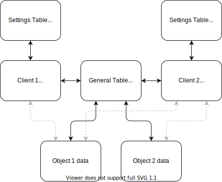

# ISIN Tracker Bot

 &emsp; 

Retrieve stock exchange information right at your fingertips

## Table of contents
- Introduction
- Getting started
- Usage
  - Custom keyboard
- Database

## Introduction
This bot is made to retrieve stock exchange information with a simple command.

Currently supported websites:
- [ING Sprinters](https://www.ingsprinters.nl)

## Getting started
- [Python 3.9.7](https://www.python.org/getit/) is recommended.

Clone the repository with:

```shell
$ git clone https://github.com/FPSUsername/ISIN_Tracker_Bot
$ cd ISIN_Tracker_Bot
```

### Virtual environment *(optional)*
- Create virtual environment
```shell
python3 -m venv venv
```
- Activate the virtual environment
```shell
source venv/bin/activate
```

### Continuation
- Install required packages
```shell
pip install -r requirements.txt
```

1. [Login to your Telegram account](https://my.telegram.org/auth) with the phone number of the developer account to use.
2. Click under API Development tools.
3. A Create new application window will appear. Fill in your application details. There is no need to enter any URL, and only the first two fields (App title and Short name) can currently be changed later.
4. Click on Create application at the end. Remember that your API hash is secret and Telegram won’t let you revoke it. Don’t post it anywhere!
5. Create a bot with [BotFather](https://t.me/BotFather) and click on API Token. Remember that your API Token is secret. In case it get leaked, revoke the API Token.

Create a file named `credentials.json` and place your credentials inside as:

```json
{
    "API_ID": YOUR_API_ID,
    "API_HASH": "YOUR_API_HASH",
    "TOKEN": "YOUR_API_TOKEN",
    "NAME": "APPLICATION_NAME"
}
```

### Running the bot
```shell
$ cd src
$ python main.py
```

### Systemd service
Create `isin_tracker_bot.service` in `/etc/systemd/services/` and modify the path, user and group accordingly:
```ini
[Unit]
Description=Telegram bot - ISIN Tracker
Wants=network.target
After=syslog.target network-online.target

[Service]
Type=simple
User=USERNAME
Group=USERNAME
WorkingDirectory=/path/to/repository
ExecStart=/path/to/repository/venv/bin/python /path/to/repository/src/main.py
Restart=on-failure
RestartSec=10
KillMode=process
StandardOutput=syslog
StandardError=syslog

[Install]
WantedBy=multi-user.target
```
Enable and start the service:
```bash
$ sudo systemctl enable isin_tracker_bot.service
$ sudo systemctl start isin_tracker_bot.service
```

## Usage

### Custom keyboard
The keyboard has four functions listed below.


#### Track
After pressing the track button, you'll be greeted by a message asking for any ISIN that's currently available on the website of ING.
Sending an ISIN will add the sprinter to your account's list.

#### List
The list button simply lists all your added sprinters, showing all the useful information about the sprinter.
It also shows the link to the ISIN and the market itself.
If you have more than 4 sprinters added, the results will be paged.

#### Remove
In order to remove a sprinter from your list, you can simply tap any sprinter in the shown list after pressing the remove button and press the confirm button afterwards.

#### Settings
The settings allow you to display or hide ISIN, Bied, Laat, %1 dag, Hefboom, Stop loss-niveau and Referentie.
By default everything is enabled.

## Database
The database works as following.


## To Do

Sprinters
- [ ] Add other websites such as PNB Paribas

Project
- [ ] Set all logging entries to their correct value (info, warning, debug)
- [ ] Cleanup code
- [ ] Structurize
- [ ] Readme/Wiki pages
- [ ] Language files support
